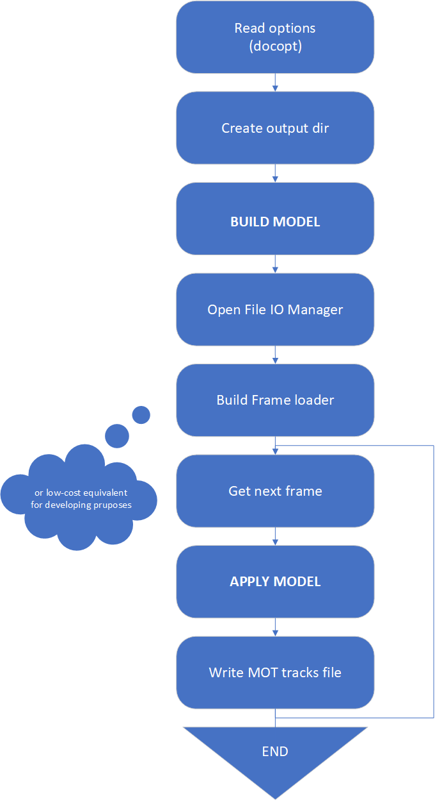

# Esquelets dels programas

<!---

-->

| generar deteccions | generar tracks |
| --- | --- |
|  |  |

Tots els programes (scripts) tenen una interficie docopt amb l'ajuda activada.

---
 

# ant_detection_pca.py

Aplica un model de detecció basat en extracció del fons (background), estimat de manera dinamica, i, posteriorment, detecció de components conexes.

A partir d'aquestes deteccions i un valor umbral basat en el nivell de gris mitja de la imatge, es segmenta la formiga per cada detecció, es calcula el PCA i s'afageix l'angle respecte a l'horitzontal les caracteristiques de la detecció.

    python3 ant_detection_pca.py ./DATA/output_4_gt.mp4 ./OUTPUT/output_4_2_pca.txt --varThreshold=20 --startWriteFrames=500

# ant_detection.py

Aplica un model de detecció basat en extracció del fons (background), estimat de manera dinamica, i, posteriorment, detecció de components conexes.

    python3 ant_detection.py ./DATA/output_4_gt.mp4 ./OUTPUT/output_4_2.txt --varThreshold=20 --startWriteFrames=500

# apparence_tracks.py

Aplica un model d'aparença a qualsevol arxiu en format MOT Challenge. Posteriorment es pot usar per descriure el track sencer i fusionar tracks amb reID.

    python3 ./DATA/output_4_gt.mp4 ./OUTPUT/ocsort_tracking_output_4_kalman.txt ocsort_tracking_output_4_kalman_apparence.txt

# associated_histograms notebooks

En aquest grup de notebooks, s'aplica l'algoritme d'assignació de tracks estimats amb els tracks reals (ground truth) definit per [MOTChallenge](https://arxiv.org/pdf/1603.00831.pdf).

## associated_histograms.ipynb

En aquest cas, no s'aplica cap correcció de fase basada en pca i s'espera que l'arxiu de tracks estimats contingui les prediccions del filtre de Kalman (perque el ground truth s'ha generat a partir de les mateixes deteccions).

Els resultats d'aquest notebook permeten estudiar graficament l'error en modul, fase (direccio i sentit) i intersection over union (IoU) entre les associacions.

## associated_histograms_pca.ipynb

En aquest cas, s'aplica una correcció de fase als desplaçaments de les formigues basada en la direcció del cos de la formiga; el sentit del canvi de fase es la mínima fase entre la fase de la predicció i la nova fase.

També s'espera que els tracks continguin les prediccions del filtre de Kalman i, adicionalment, l'angle amb l'eix X del cos de la formiga en la columna #10 (no usada en tracks 2D, previament reservada per les coordenades Z de tracks 3D).

Els resultats d'aquest notebook peremten estudiar graficament l'error en fase i  intersection over union (IoU) entre les associacions i comparar els errors del sistema amb PCA amb el sistema sense PCA.

# deepsort_track.py

Aplica el model de tracking definit en [DeepSORT](https://arxiv.org/pdf/1703.07402.pdf). Requereix un arxiu amb les deteccions i els descriptors d'aparença en format MOT Challenge ampliat (resultat de deepsort_detection.py).

    python3 deepsort_track.py OUTPUT/output_4_apparence.txt deepsort_tracking_output_4.txt --iouThreshold=0.1

# hota_idf1.ipynb

Notebook on s'aplica la biblioteca [evaldet](https://github.com/tadejsv/EvalDeT) per calcular les metriques habituals en problemes de tracking (CLEARMOT, IDs i HOTA).

Els resultats del notebook permeten observar els valors numerics en forma tabular. També permet observar graficament la evolució de les components del HOTA en funció del parametre $\alpha$.

# minimum_id.py

Script per modificar els IDs discontinuus dels tracks detectats en IDs continuus desde 1 fins al nombre de tracks.

    python3 minimum_id.py DATA/output_4_gt.txt DATA/output_4_gt_min.txt

# ocsort_track.py

Aplica el model de tracking definit en [OCSort](https://arxiv.org/pdf/2203.14360.pdf). Requereix un arxiu amb les deteccions en format MOT Challenge (resultat de ant_detection.py).

    python3 ocsort_track.py DATA/detections.txt test.txt --iouThreshold=0.1 --associationFunc=ciou

# pca_tracks.py

A partir d'un arxiu de tracking en format MOTChallenge i un valor umbral basat en el nivell de gris mitja de la imatge, es segmenta la formiga per cada detecció, es calcula el PCA i s'afageix l'angle respecte a l'horitzontal les caracteristiques de la linea del arxiu.

    python3 pca_tracks.py DATA/output_4_gt.mp4 OUTPUT/ocsort_tracking_output_4.txt output_4_dets_pca.txt

# plot_pca_directions.ipynb

Notebook per comprobar el correcte funcionament del sistema amb PCA. Es pot observar graficament la segmentació de les formigues i els vectors de desplaçament que s'aplicarien usant Kalman o PCA.

Nomes s'observa un frame a la vegada i el numero de frames a avançar l'escull l'usuari al moment (cap numero o Esc avança 1 frame, un nombre negatiu o caracter no numeric finalitça el bloc).

# plot_rectangles_video.py

No he mirat el funcionament del codi, permet generar videos amb els tracks dibuixats en diferents colors.

    python3 plot_rectangles_video.py DATA/output_4_gt.txt DATA/output_4_gt.mp4 output_4_gt_rectangles.mp4 --downsampleVideo=True

# pred_to_cvat.py

A partir d'un arxiu de tracking en format MOTChallenge amb IDs minimes (resultat de minimum_id.py) genera un ZIP i un JSON.

EL JSON conté el text necessari per definir les etiquetes d'una tasca de CVAT, s'aplicarà copiant i enganxant el contingut.

El ZIP conté una carpeta amb un arxiu de text amb tracks en format MOT1.1 i un altre arxiu de text amb nomes per cada etiqueta. Aquest ZIP es pot usar per carregar els resultats del model a la tasca de CVAT configurada amb el JSON anterior.

    python3 pred_to_cvat.py DATA/output_4_gt_min.txt gt.zip

# sort_inference.py

Aplica el model de tracking definit en [SORT](https://arxiv.org/pdf/1602.00763.pdf). Requereix un arxiu amb les deteccions en format MOT Challenge (resultat de ant_detection.py).

    python3 sort_inference.py DATA/detections.txt

# unassociated_histograms.ipynb

Aquest notebook serveix per observar i comparar les distribuicions de 2 arxius de tracking, considerant una el _ground truth_.

Els resultats son histogrames de:
* velocitat (desplaçament en pixels / frame), 
* IoU entre dos frmaes consecutius d'un mateix track (per tots els tracks).
* cIoU entre dos frmaes consecutius d'un mateix track (per tots els tracks).
