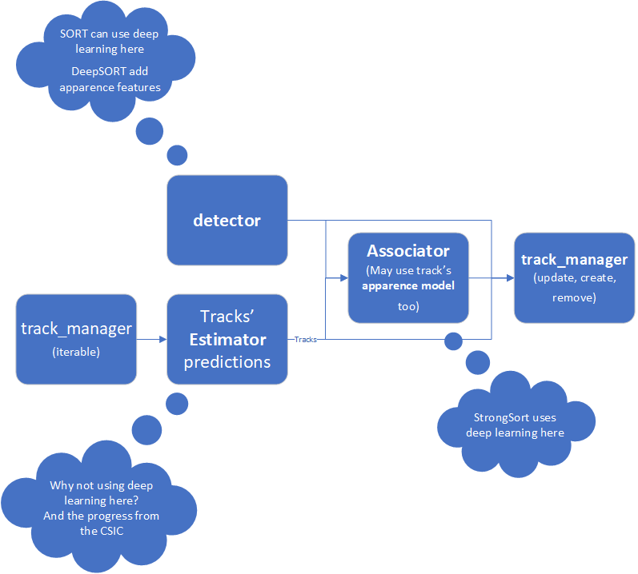
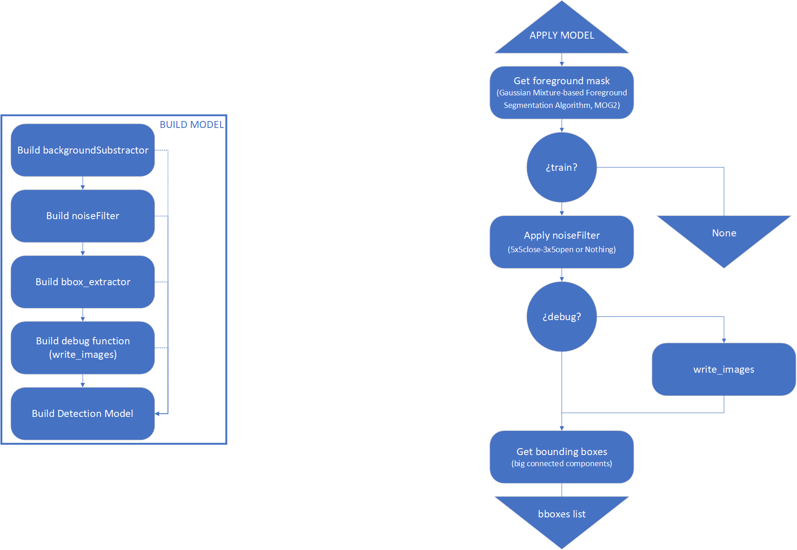
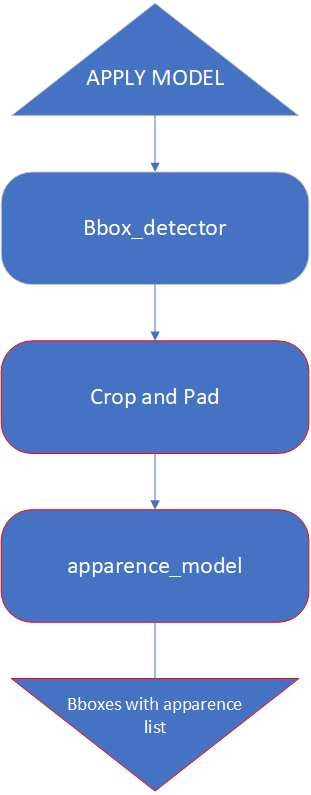

# SORT family models

Tots els models de la familia SORT es poden definir com una combinació d'un detector, un gestor de tracks, un estimador, un associador i, opcionalment, un model d'aparença. Com a input nomes requereixen la imatge actual i s'implemnta com un objecte callable (sort_model(frame)).

El detector te com a input una imatge (font primaria d'informació) i com a output un conjunt de bounding boxes (observacions). En etapa de desenvolupament es pot usar un "loader" de deteccions previes i, en cas d'usar models d'apparença, també es pot afegir els descriptors de cada detecció.

El gestor de tracks (track manager) emmagatzema els tracks actius, cada track conté un estimador i pot contenir un model d'aparença. En aquesta implementació, el track manager es defineix de la següent manera:
* Cal crear-lo especificant el tipus d'estimador, el tipus de model d'aparença (o None) i el tipus de track a usar.
* Iterable: al iterar, s'aplica un pas de predicció en l'estimador del track (track.predict()) i cada iteració te el track actualitzat com a output.
* Callable: al aplicar-ho te com a input les detections actuals i els matches entre prediccions i deteccions actuals. Com a output te els resultats del tracker en el frame actual. Internament actualitza els tracks (track.update).

El track es crea mitjançant un estimador iniciat (amb la observació actual) i un model d'aparença iniciat (amb la observació actual, pot ser None) automaticament al aplicar el track manager en cas d'obtenir deteccions no associades a cap estimació. El track es destrueix en el track manager si no s'ha detectat en un cert nombre de frames.

L'associador s'encarega de relacionar les estimacions de cada track en el track manager amb les deteccions. Te com a input l'imatge actual (per poder aplicar certs models), les deteccions del frame actual i els tracks actuals. Per obtenir els resultats de la prediccio, el track actua com una memoria de prediccions desde l'última observació (track.\_\_getitem\_\_(-1) o track\[-1\]). Per poder obtenir una puntuació d'aparença basada en caracteristiques propies del track, el track es callable (track.\_\_call\_\_(query) o track(query)). El model d'aparença pot dependre totalment del associador en lloc del track en alguns casos.

L'estimador te definit l'etapa de prediccio en el metode \_\_call\_\_ (callable) i un metode _update_ per afegir l'ultima observació detectada.

_Diferents models es descriuen basant-se en aquesta interficie i, fins a cert punt, poden intercanviar-se. Per exemple, en alguns casos les estimacions o les deteccions requereixen més informació que just la bounding box (covariancia, aparença, etc); no obstant, el format transmés es una matriu de vectors fila amb bounding boxes i puntuació de deteccio en les 5 primeres columnes._

# Foreground Connected Detector

# Apparence Detector

Les deteccions obtingudes no canvien de mida. En cas de ser petites, s'amplien per tots els cantons amb el valor mig de la imatge. En cas de ser massa grans, es retallen (no sol passar).

