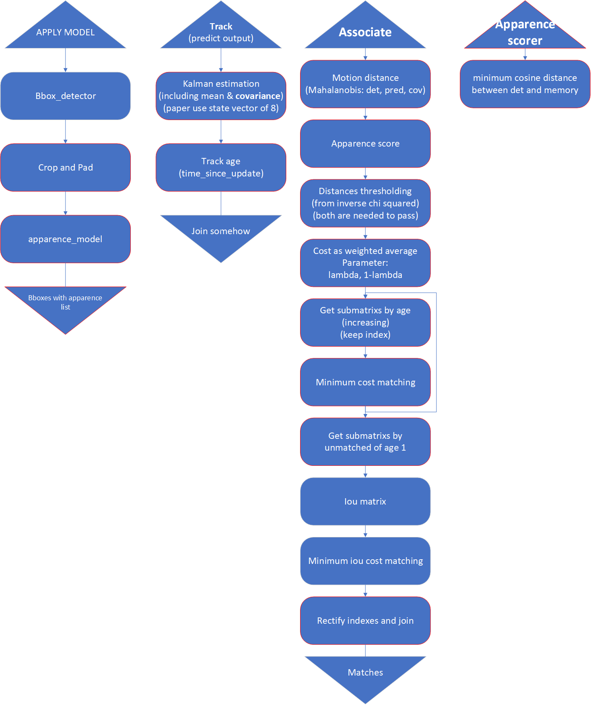

# DeepSORT

[article](https://arxiv.org/pdf/1703.07402.pdf)

DeepSORT necesita un detector que afegeix caracteristiques d'aparença (APPLY MODEL en la imatge).

## SORT (recordatori)

El gestor de track de deep SORT funciona com en el SORT.

